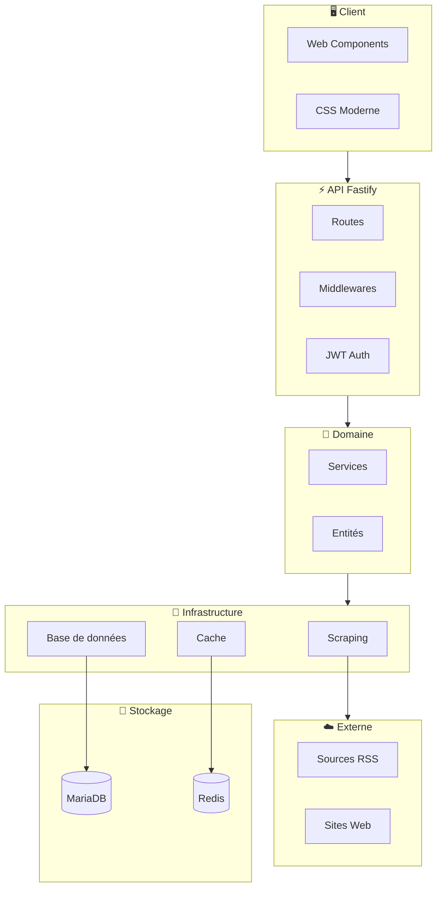
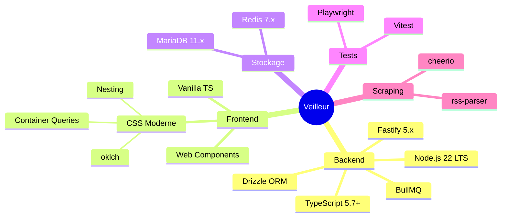
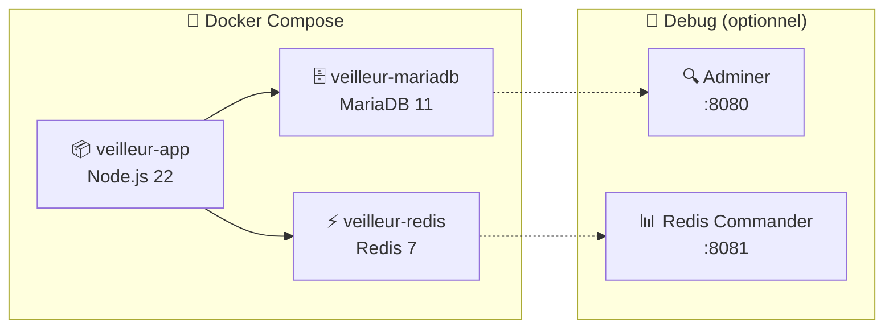
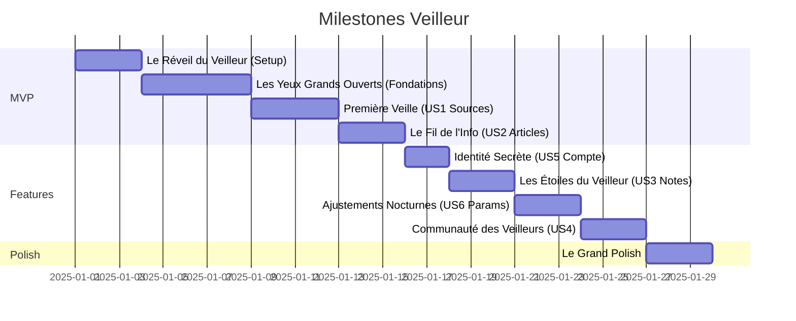

<p align="center">
  
</p>

<h1 align="center">Veilleur</h1>

<p align="center">
  <strong>Votre sentinelle de l'information</strong>
</p>

<p align="center">
  <a href="#-fonctionnalités">Fonctionnalités</a> •
  <a href="#-démarrage-rapide">Démarrage</a> •
  <a href="#-stack-technique">Stack</a> •
  <a href="#-documentation">Documentation</a>
</p>

<p align="center">
  
  
  
  
  
  
</p>

<p align="center">
  
  
  
  
</p>

---

## 📖 À propos

**Veilleur** est un agrégateur d'actualités libre et open source. Ajoutez vos sources RSS et sites web favoris, personnalisez votre fil d'actualités, et découvrez de nouvelles sources via la communauté.

> *« Restez informé, simplement. »*

---

## ✨ Fonctionnalités

<table>
<tr>
<td width="50%">

### 📰 Agrégation
- Ajout de sources RSS et sites web
- Détection automatique des flux
- Extraction des métadonnées (Open Graph, Twitter Cards)

### 🎯 Personnalisation
- Notation des sources (1-5 étoiles)
- Tags personnalisés
- Paramètres avancés par source

</td>
<td width="50%">

### 🌐 Communauté
- Découverte de sources populaires
- Filtrage par tags
- Notes moyennes communautaires

### ⚡ Performance
- Cache agressif (90% hit rate)
- Réponses < 200ms (p95)
- 1000 utilisateurs simultanés

</td>
</tr>
</table>

---

## 🏗️ Architecture



---

## 🚀 Démarrage Rapide

### Avec Docker (Recommandé)

```bash
# 1. Cloner le projet
git clone https://github.com/yrbane/veilleur.git
cd veilleur

# 2. Configurer et démarrer
cp .env.example .env
make dev
```

<p align="center">
  
  
  
</p>

### 📋 Commandes Make

| Commande | Description |
|:---------|:------------|
| `make dev` | 🟢 Démarrer l'environnement |
| `make down` | 🔴 Arrêter les conteneurs |
| `make logs` | 📜 Voir les logs |
| `make shell` | 💻 Shell dans l'app |
| `make db-shell` | 🗄️ Shell MariaDB |
| `make test` | 🧪 Lancer les tests |
| `make debug` | 🔧 Avec outils admin |
| `make help` | ❓ Toutes les commandes |

### Sans Docker

```bash
git clone https://github.com/yrbane/veilleur.git
cd veilleur
npm install
cp .env.example .env
# Configurer MariaDB et Redis localement
npm run db:migrate
npm run dev
```

---

## 🛠️ Stack Technique



### Détail des technologies

<table>
<tr>
<th>Catégorie</th>
<th>Technologie</th>
<th>Rôle</th>
</tr>
<tr>
<td rowspan="5">🔙 Backend</td>
<td></td>
<td>Runtime JavaScript</td>
</tr>
<tr>
<td></td>
<td>Framework web performant</td>
</tr>
<tr>
<td></td>
<td>Typage statique</td>
</tr>
<tr>
<td></td>
<td>ORM type-safe</td>
</tr>
<tr>
<td></td>
<td>File de tâches Redis</td>
</tr>
<tr>
<td rowspan="3">🎨 Frontend</td>
<td></td>
<td>Composants natifs</td>
</tr>
<tr>
<td></td>
<td>Styles modernes</td>
</tr>
<tr>
<td></td>
<td>Build tool</td>
</tr>
<tr>
<td rowspan="2">💾 Stockage</td>
<td></td>
<td>Base de données relationnelle</td>
</tr>
<tr>
<td></td>
<td>Cache et sessions</td>
</tr>
<tr>
<td rowspan="2">🧪 Tests</td>
<td></td>
<td>Tests unitaires</td>
</tr>
<tr>
<td></td>
<td>Tests E2E</td>
</tr>
<tr>
<td rowspan="2">🔍 Scraping</td>
<td></td>
<td>Parsing HTML</td>
</tr>
<tr>
<td></td>
<td>Parsing RSS/Atom</td>
</tr>
</table>

---

## 🐳 Docker

### Services



### Volumes persistants

| Volume | Contenu |
|:-------|:--------|
| `veilleur-mariadb-data` | Données MariaDB |
| `veilleur-redis-data` | Données Redis (AOF) |

---

## 📚 Documentation

| Document | Description |
|:---------|:------------|
| 📋 [Spécification](./specs/001-agregateur-actualites/spec.md) | User stories et exigences |
| 🗺️ [Plan](./specs/001-agregateur-actualites/plan.md) | Plan d'implémentation |
| 📊 [Data Model](./specs/001-agregateur-actualites/data-model.md) | Schéma de données |
| 🔌 [API](./specs/001-agregateur-actualites/contracts/api.yaml) | Contrat OpenAPI |
| 🔬 [Recherche](./specs/001-agregateur-actualites/research.md) | Choix techniques |
| 🚀 [Quickstart](./specs/001-agregateur-actualites/quickstart.md) | Guide de démarrage |
| ✅ [Tâches](./specs/001-agregateur-actualites/tasks.md) | 101 tâches à réaliser |

---

## 📈 Roadmap



---

## 🎯 Principes

<table>
<tr>
<td align="center" width="14%">

<br/><sub>Tests avant code</sub>
</td>
<td align="center" width="14%">

<br/><sub>Security by design</sub>
</td>
<td align="center" width="14%">

<br/><sub>Cache agressif</sub>
</td>
<td align="center" width="14%">

<br/><sub>Code propre</sub>
</td>
<td align="center" width="14%">

<br/><sub>Ergonomie</sub>
</td>
<td align="center" width="14%">

<br/><sub>Tout en français</sub>
</td>
<td align="center" width="14%">

<br/><sub>Beauté du code</sub>
</td>
</tr>
</table>

---

## 🤝 Contribution

Les contributions sont les bienvenues ! Consultez les [issues](https://github.com/yrbane/veilleur/issues) pour voir les tâches disponibles.

```bash
# Fork et clone
git clone https://github.com/votre-user/veilleur.git

# Créer une branche
git checkout -b feature/ma-fonctionnalite

# Développer avec TDD
make test-watch

# Push et PR
git push origin feature/ma-fonctionnalite
```

---

## 📄 Licence

<p align="center">
  
</p>

---

<p align="center">
  <sub>Fait avec ❤️ par la communauté</sub>
</p>

<p align="center">
  <a href="https://github.com/yrbane/veilleur">
    
  </a>
</p>
